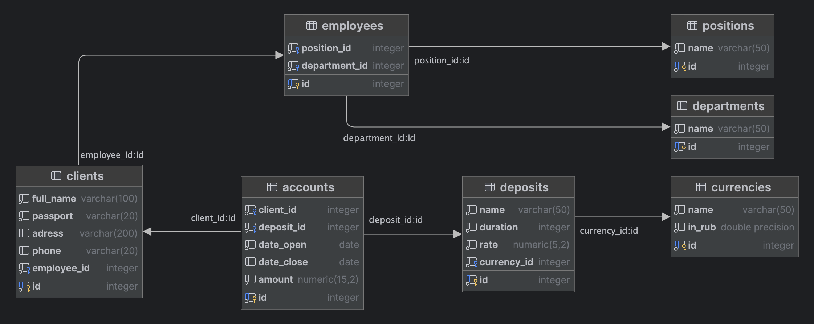
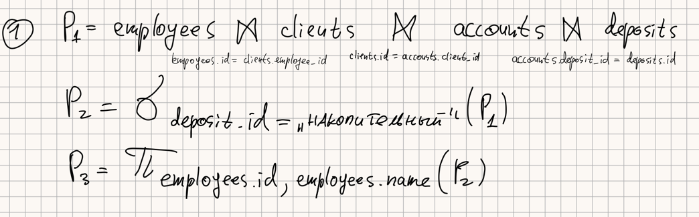
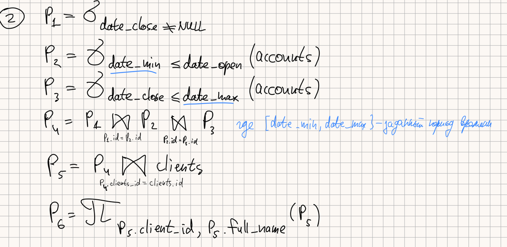
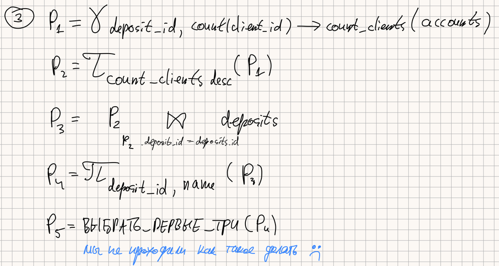
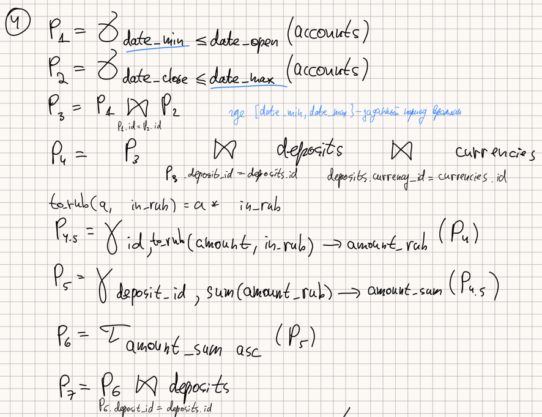
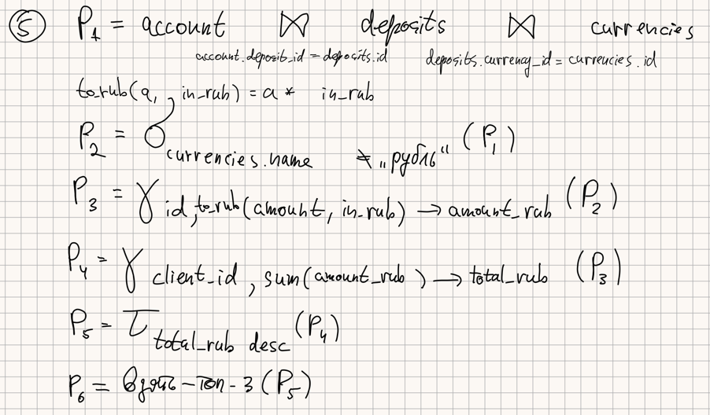
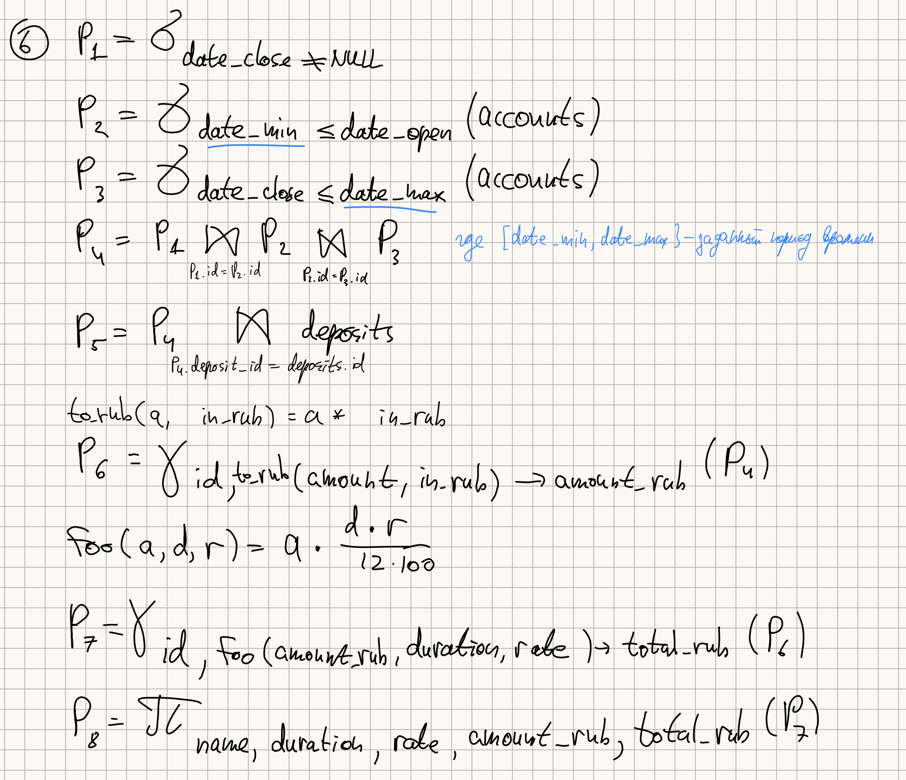

# Задание

# Отчет

### ER-диаграмма

ER-диаграмма создана через DataGrip.



### Базы данных

**employees**

| Имя атрибута  | Тип атрибута | Ограничение | Описание атрибута |
|---------------|--------------|-------------|-------------------|
| id            | integer      | Primary key | ID                |
| position_id   | integer      | Foreign key | ID должности      |
| department_id | integer      | Foreign key | ID отдела         |

**positions**

| Имя атрибута | Тип атрибута | Ограничение | Описание атрибута  |
|--------------|--------------|-------------|--------------------|
| id           | integer      | Primary key | ID                 |
| name         | varchar(50)  |             | Название должности |

**departments**

| Имя атрибута | Тип атрибута | Ограничение | Описание атрибута |
|--------------|--------------|-------------|-------------------|
| id           | integer      | Primary key | ID                |
| name         | varchar(50)  |             | Название отдела   |

**clients**

| Имя атрибута | Тип атрибута | Ограничение | Описание атрибута |
|--------------|--------------|-------------|-------------------|
| id           | integer      | Primary key | ID                |
| full_name    | varchar(100) |             | Полное имя        |
| passport     | varchar(20)  |             | Паспортные данные |
| address      | varchar(200) |             | Адрес             |
| phone        | varchar(20)  |             | Телефон           |
| employee_id  | integer      | Foreign key | ID сотрудника     |

**accounts**

| Имя атрибута | Тип атрибута  | Ограничение | Описание атрибута |
|--------------|---------------|-------------|-------------------|
| id           | integer       | Primary key | ID                |
| client_id    | integer       | Foreign key | ID клиента        |
| deposit_id   | integer       | Foreign key | ID депозита       |
| date_open    | date          |             | Дата открытия     |
| date_close   | date          |             | Дата закрытия     |
| amount       | numeric(15,2) |             | Сумма             |

**deposits**

| Имя атрибута | Тип атрибута | Ограничение | Описание атрибута |
|--------------|--------------|-------------|-------------------|
| id           | integer      | Primary key | ID                |
| name         | varchar(50)  |             | Название депозита |
| duration     | integer      |             | Срок депозита     |
| rate         | numeric(5,2) |             | Процентная ставка |
| currency_id  | integer      | Foreign key | ID валюты         |

**currencies**

| Имя атрибута | Тип атрибута     | Ограничение | Описание атрибута |
|--------------|------------------|-------------|-------------------|
| id           | integer          | Primary key | ID                |
| name         | varchar(50)      |             | Название валюты   |
| in_rub       | double precision |             | Курс к рублю      |

### Код для создание базы данн

Код для создание БД:

```postgresql
create table public.positions
(
    id   serial primary key,
    name character varying(50) not null
);

create table public.departments
(
    id   serial primary key,
    name character varying(50) not null
);

create table currencies
(
    id     serial primary key,
    name   varchar(50)      not null,
    in_rub double precision not null
);

create table public.deposits
(
    id          serial primary key,
    name        character varying(50) not null,
    duration    integer               not null,
    rate        numeric(5, 2)         not null,
    currency_id integer               not null,
    foreign key (currency_id) references public.currencies (id)
        match simple on update no action on delete no action
);


create table public.employees
(
    id            serial primary key,
    position_id   integer not null,
    department_id integer not null,
    foreign key (department_id) references public.departments (id)
        match simple on update no action on delete no action,
    foreign key (position_id) references public.positions (id)
        match simple on update no action on delete no action
);


create table public.clients
(
    id          serial primary key,
    full_name   character varying(100) not null,
    passport    character varying(20)  not null,
    adress      character varying(200),
    phone       character varying(20),
    employee_id integer                not null,
    foreign key (employee_id) references public.employees (id)
        match simple on update no action on delete no action
);


create table public.accounts
(
    id         serial primary key,
    client_id  integer        not null,
    deposit_id integer        not null,
    date_open  date           not null,
    date_close date,
    amount     numeric(15, 2) not null,
    foreign key (client_id) references public.clients (id)
        match simple on update no action on delete no action,
    foreign key (deposit_id) references public.deposits (id)
        match simple on update no action on delete no action
);

```

### Наполнение базы данных данными

Заполним справочники

```postgresql
INSERT INTO public.currencies (name, in_rub)
VALUES ('Рубли', 1.00),
       ('Доллары США', 89.35),
       ('Юани', 12.60);

INSERT INTO public.departments (name)
VALUES ('Отдел вкладов'),
       ('Отдел обслуживания клиентов'),
       ('Отдел маркетинга');

INSERT INTO public.positions (name)
VALUES ('Менеджер'),
       ('Младший консультант'),
       ('Старший консультант'),
       ('Директор');

INSERT INTO public.deposits (name, duration, rate, currency_id)
VALUES ('Накопительный', 13, 10.00, 1),
       ('Капитал', 18, 7.00, 2),
       ('Друзья', 13, 2.00, 3),
       ('Пенсионный', 12, 12.00, 1),
       ('Молодежный', 36, 18.00, 1);
```

### Реализация задания

Код для очистки БД:

```postgresql
TRUNCATE TABLE public.accounts RESTART IDENTITY CASCADE;
TRUNCATE TABLE public.clients RESTART IDENTITY CASCADE;
TRUNCATE TABLE public.employees RESTART IDENTITY CASCADE;
```

1. Получить список сотрудников, курирующих вкладчиков вклада
   «Накопительный»



```postgresql
SELECT e.id, d.name
FROM employees e
JOIN clients c ON e.id = c.employee_id
JOIN accounts a ON c.id = a.client_id
JOIN deposits d ON a.deposit_id = d.id
WHERE d.name = 'Накопительный';
```

0 строк

```postgresql
TRUNCATE TABLE public.accounts RESTART IDENTITY CASCADE;
TRUNCATE TABLE public.clients RESTART IDENTITY CASCADE;
TRUNCATE TABLE public.employees RESTART IDENTITY CASCADE;

INSERT INTO public.employees (position_id, department_id)
VALUES (1, 1), (2, 2);

INSERT INTO public.clients (full_name, passport, adress, phone, employee_id)
VALUES ('Иван Иванов', '1234 567890', 'ул. Перескокова, д. 1', '89991234567', 1),
       ('Петр Петров', '2345 678901', 'ул. Кочета, д. 2', '89992345678', 2);

INSERT INTO public.accounts (client_id, deposit_id, date_open, date_close, amount)
VALUES (1, 2, '2023-01-01', NULL, 100000.00),
       (2, 3, '2023-01-01', NULL, 200000.00);
```

1 строка

```postgresql
TRUNCATE TABLE public.accounts RESTART IDENTITY CASCADE;
TRUNCATE TABLE public.clients RESTART IDENTITY CASCADE;
TRUNCATE TABLE public.employees RESTART IDENTITY CASCADE;

INSERT INTO public.employees (position_id, department_id)
VALUES (1, 1);

INSERT INTO public.clients (full_name, passport, adress, phone, employee_id)
VALUES ('Иван Иванов', '1234 567890', 'ул. Перескокова, д. 1', '89991234567', 1);

INSERT INTO public.accounts (client_id, deposit_id, date_open, date_close, amount)
VALUES (1, 1, '2023-01-01', NULL, 100000.00);
```

| id | name |
| :--- | :--- |
| 1 | Накопительный |

2+ строки

```postgresql
TRUNCATE TABLE public.accounts RESTART IDENTITY CASCADE;
TRUNCATE TABLE public.clients RESTART IDENTITY CASCADE;
TRUNCATE TABLE public.employees RESTART IDENTITY CASCADE;

INSERT INTO public.employees (position_id, department_id)
VALUES (1, 1), (2, 1);

INSERT INTO public.clients (full_name, passport, adress, phone, employee_id)
VALUES ('Иван Иванов', '1234 567890', 'ул. Перескокова, д. 1', '89991234567', 1),
       ('Петр Петров', '2345 678901', 'ул. Кочета, д. 2', '89992345678', 2);

INSERT INTO public.accounts (client_id, deposit_id, date_open, date_close, amount)
VALUES (1, 1, '2023-01-01', NULL, 100000.00),
       (2, 1, '2023-01-01', NULL, 200000.00);
```

| id | name |
| :--- | :--- |
| 1 | Накопительный |
| 2 | Накопительный |


2. Получить список вкладчиков, закрывших свои вклады, в заданный период
   времени



```postgresql
SELECT c.id, c.full_name
FROM clients c
JOIN accounts a ON c.id = a.client_id
WHERE a.date_close IS NOT NULL
AND a.date_close BETWEEN '2023-01-01' AND '2023-12-31';
```

0 строк

```postgresql
TRUNCATE TABLE public.accounts RESTART IDENTITY CASCADE;
TRUNCATE TABLE public.clients RESTART IDENTITY CASCADE;
TRUNCATE TABLE public.employees RESTART IDENTITY CASCADE;

INSERT INTO public.employees (position_id, department_id)
VALUES (1, 1), (2, 2);

INSERT INTO public.clients (full_name, passport, adress, phone, employee_id)
VALUES ('Иван Иванов', '1234 567890', 'ул. Перескокова, д. 1', '89991234567', 1),
       ('Петр Петров', '2345 678901', 'ул. Кочета, д. 2', '89992345678', 2);

INSERT INTO public.accounts (client_id, deposit_id, date_open, date_close, amount)
VALUES (1, 1, '2023-01-01', NULL, 100000.00), 
       (2, 1, '2022-01-01', '2022-12-31', 200000.00); 
```

1 строка

```postgresql
TRUNCATE TABLE public.accounts RESTART IDENTITY CASCADE;
TRUNCATE TABLE public.clients RESTART IDENTITY CASCADE;
TRUNCATE TABLE public.employees RESTART IDENTITY CASCADE;

INSERT INTO public.employees (position_id, department_id)
VALUES (1, 1);

INSERT INTO public.clients (full_name, passport, adress, phone, employee_id)
VALUES ('Иван Иванов', '1234 567890', 'ул. Перескокова, д. 1', '89991234567', 1);

INSERT INTO public.accounts (client_id, deposit_id, date_open, date_close, amount)
VALUES (1, 1, '2023-01-01', '2023-06-01', 100000.00);
```

| id | full\_name |
| :--- | :--- |
| 1 | Иван Иванов |


2+ строки

```postgresql
TRUNCATE TABLE public.accounts RESTART IDENTITY CASCADE;
TRUNCATE TABLE public.clients RESTART IDENTITY CASCADE;
TRUNCATE TABLE public.employees RESTART IDENTITY CASCADE;

INSERT INTO public.employees (position_id, department_id)
VALUES (1, 1), (2, 1);

INSERT INTO public.clients (full_name, passport, adress, phone, employee_id)
VALUES ('Иван Иванов', '1234 567890', 'ул. Перескокова, д. 1', '89991234567', 1),
       ('Петр Петров', '2345 678901', 'ул. Кочета, д. 2', '89992345678', 2);

INSERT INTO public.accounts (client_id, deposit_id, date_open, date_close, amount)
VALUES (1, 1, '2023-01-01', '2023-06-01', 100000.00),
       (2, 1, '2023-01-01', '2023-11-15', 200000.00);
```

| id | full\_name |
| :--- | :--- |
| 1 | Иван Иванов |
| 2 | Петр Петров |


3. Определить ТОП 3 наиболее популярных вкладов банка (критерий –
   количество вкладчиков)



```postgresql
SELECT c.deposit_id, name
FROM deposits d
JOIN (
    SELECT a.deposit_id, COUNT(a.client_id) as count_clients
    FROM accounts a
    GROUP BY deposit_id
    ORDER BY count_clients DESC
) c on c.deposit_id = d.id
LIMIT 3;
```

0 строк

```postgresql
TRUNCATE TABLE public.accounts RESTART IDENTITY CASCADE;
TRUNCATE TABLE public.clients RESTART IDENTITY CASCADE;
TRUNCATE TABLE public.employees RESTART IDENTITY CASCADE;

INSERT INTO public.employees (position_id, department_id)
VALUES (1, 1), (2, 2);

INSERT INTO public.clients (full_name, passport, adress, phone, employee_id)
VALUES ('Иван Иванов', '1234 567890', 'ул. Перескокова, д. 1', '89991234567', 1),
       ('Петр Петров', '2345 678901', 'ул. Кочета, д. 2', '89992345678', 2);
```

1 строка

```postgresql
TRUNCATE TABLE public.accounts RESTART IDENTITY CASCADE;
TRUNCATE TABLE public.clients RESTART IDENTITY CASCADE;
TRUNCATE TABLE public.employees RESTART IDENTITY CASCADE;

INSERT INTO public.employees (position_id, department_id)
VALUES (1, 1);

INSERT INTO public.clients (full_name, passport, adress, phone, employee_id)
VALUES ('Иван Иванов', '1234 567890', 'ул. Перескокова, д. 1', '89991234567', 1);

INSERT INTO public.accounts (client_id, deposit_id, date_open, date_close, amount)
VALUES (1, 1, '2023-01-01', NULL, 100000.00);
```

| deposit\_id | name |
| :--- | :--- |
| 1 | Накопительный |


2+ строки

```postgresql
TRUNCATE TABLE public.accounts RESTART IDENTITY CASCADE;
TRUNCATE TABLE public.clients RESTART IDENTITY CASCADE;
TRUNCATE TABLE public.employees RESTART IDENTITY CASCADE;

INSERT INTO public.employees (position_id, department_id)
VALUES (1, 1), (2, 1);

INSERT INTO public.clients (full_name, passport, adress, phone, employee_id)
VALUES ('Иван Иванов', '1234 567890', 'ул. Перескокова, д. 1', '89991234567', 1),
       ('Петр Петров', '2345 678901', 'ул. Кочета, д. 2', '89992345678', 2),
       ('Сергей Сергеев', '3456 789012', 'ул. Миколаенко, д. 3', '89993456789', 1),
       ('Алексей Алексеев', '4567 890123', 'ул. Парусниковой, д. 4', '89994567890', 2);

INSERT INTO public.accounts (client_id, deposit_id, date_open, date_close, amount)
VALUES (1, 1, '2023-01-01', NULL, 100000.00),
       (2, 1, '2023-02-01', NULL, 150000.00),
       (3, 2, '2023-03-01', NULL, 200000.00),
       (4, 3, '2023-04-01', NULL, 250000.00);
```

| deposit\_id | name |
| :--- | :--- |
| 1 | Накопительный |
| 2 | Капитал |
| 3 | Друзья |


4. Определить вклад, который «принес» меньше всего денежных средств
   банку (сумма вложенных средств по вкладу) в течение заданного периода.



```postgresql
SELECT am.id, d.name
FROM deposits d
JOIN (
    SELECT r.id, SUM(amount_rub) as amount_sum
    FROM (
        SELECT a.id, a.amount * c.in_rub as amount_rub
        FROM accounts a
        JOIN deposits d ON a.deposit_id = d.id
        JOIN currencies c on d.currency_id = c.id
        WHERE '2023-01-01' <= a.date_open AND a.date_close <= '2023-12-31'
    ) r
    GROUP BY r.id
    ORDER BY amount_sum
    LIMIT 1
) am ON am.id = d.id;
```

0 строк

```postgresql
TRUNCATE TABLE public.accounts RESTART IDENTITY CASCADE;
TRUNCATE TABLE public.clients RESTART IDENTITY CASCADE;
TRUNCATE TABLE public.employees RESTART IDENTITY CASCADE;

INSERT INTO public.employees (position_id, department_id)
VALUES (1, 1), (2, 2);

INSERT INTO public.clients (full_name, passport, adress, phone, employee_id)
VALUES ('Иван Иванов', '1234 567890', 'ул. Перескокова, д. 1', '89991234567', 1),
       ('Петр Петров', '2345 678901', 'ул. Кочета, д. 2', '89992345678', 2);

INSERT INTO public.accounts (client_id, deposit_id, date_open, date_close, amount)
VALUES (1, 1, '2022-01-01', '2022-12-31', 100000.00),
       (2, 2, '2022-01-01', '2022-12-31', 150000.00);
```

1 строка

```postgresql
TRUNCATE TABLE public.accounts RESTART IDENTITY CASCADE;
TRUNCATE TABLE public.clients RESTART IDENTITY CASCADE;
TRUNCATE TABLE public.employees RESTART IDENTITY CASCADE;

INSERT INTO public.employees (position_id, department_id)
VALUES (1, 1), (2, 1);

INSERT INTO public.clients (full_name, passport, adress, phone, employee_id)
VALUES ('Иван Иванов', '1234 567890', 'ул. Перескокова, д. 1', '89991234567', 1),
       ('Петр Петров', '2345 678901', 'ул. Кочета, д. 2', '89992345678', 2),
       ('Сергей Сергеев', '3456 789012', 'ул. Миколаенко, д. 3', '89993456789', 1),
       ('Алексей Алексеев', '4567 890123', 'ул. Парусниковой, д. 4', '89994567890', 2);

INSERT INTO public.accounts (client_id, deposit_id, date_open, date_close, amount)
VALUES (1, 1, '2023-01-01', '2023-06-01', 100000.00), 
       (2, 2, '2023-02-01', '2023-07-01', 150000.00), 
       (3, 3, '2023-03-01', '2023-08-01', 200000.00), 
       (4, 1, '2023-04-01', '2023-09-01', 50000.00);  
```

| id | name |
| :--- | :--- |
| 4 | Пенсионный |


5. Получить ТОП 3 вкладчиков, имеющих вклады в иностранной валюте.
   Суммарный объем вкладов определяется в рублях.



```postgresql
SELECT id, full_name
FROM (
    SELECT r.client_id, SUM(amount_rub) AS total_rub
    FROM (
        SELECT a.id, a.client_id, a.id * in_rub AS amount_rub, c.name
        FROM accounts a
        JOIN deposits d ON a.deposit_id = d.id
        JOIN currencies c on d.currency_id = c.id
        WHERE c.name != 'Рубли'
    ) r
    GROUP BY r.client_id
    ORDER BY total_rub DESC
    LIMIT 3
) p
JOIN clients ON client_id = clients.id;
```

0 строк

```postgresql
TRUNCATE TABLE public.accounts RESTART IDENTITY CASCADE;
TRUNCATE TABLE public.clients RESTART IDENTITY CASCADE;
TRUNCATE TABLE public.employees RESTART IDENTITY CASCADE;

INSERT INTO public.employees (position_id, department_id)
VALUES (1, 1), (2, 2);

INSERT INTO public.clients (full_name, passport, adress, phone, employee_id)
VALUES ('Иван Иванов', '1234 567890', 'ул. Перескокова, д. 1', '89991234567', 1),
       ('Петр Петров', '2345 678901', 'ул. Кочета, д. 2', '89992345678', 2);

INSERT INTO public.accounts (client_id, deposit_id, date_open, date_close, amount)
VALUES (1, 1, '2023-01-01', NULL, 100000.00);
```

3 строки

```postgresql
TRUNCATE TABLE public.accounts RESTART IDENTITY CASCADE;
TRUNCATE TABLE public.clients RESTART IDENTITY CASCADE;
TRUNCATE TABLE public.employees RESTART IDENTITY CASCADE;

INSERT INTO public.employees (position_id, department_id)
VALUES (1, 1), (2, 1);

INSERT INTO public.clients (full_name, passport, adress, phone, employee_id)
VALUES ('Иван Иванов', '1234 567890', 'ул. Перескокова, д. 1', '89991234567', 1),
       ('Петр Петров', '2345 678901', 'ул. Кочета, д. 2', '89992345678', 2),
       ('Сергей Сергеев', '3456 789012', 'ул. Миколаенко, д. 3', '89993456789', 1),
       ('Алексей Алексеев', '4567 890123', 'ул. Парусниковой, д. 4', '89994567890', 2);

INSERT INTO public.accounts (client_id, deposit_id, date_open, date_close, amount)
VALUES (1, 1, '2023-01-01', '2023-06-01', 100000.00), 
       (2, 2, '2023-02-01', '2023-07-01', 150000.00), 
       (2, 2, '2023-02-02', '2023-07-01', 160000.00), 
       (4, 2, '2023-02-03', '2023-07-01', 170000.00), 
       (3, 3, '2023-03-01', '2023-08-01', 200000.00), 
       (4, 1, '2023-04-01', '2023-09-01', 50000.00);  
```

| id | full\_name |
| :--- | :--- |
| 2 | Петр Петров |
| 3 | Сергей Сергеев |
| 4 | Алексей Алексеев |


6. Сформировать ведомость получения доходов клиентами банка
   по закрытым счетам за заданный период в табличной форме

| Наименование вклада | Срок хранения, месяцев | Ставка, % годовых | Сумма вложенная, руб. | Сумма накопления, руб. |
|---------------------|------------------------|-------------------|-----------------------|------------------------|

где "Сумма накопления, руб." = " Сумма вложенная, руб." * ("Срок хранения, месяцев" * "Ставка, % годовых" : 12) : 100



```postgresql
SELECT name, duration, rate, amount_rub, (amount_rub * duration * rate) / 1200 AS total_rub
FROM (
    SELECT a.amount * c.in_rub AS amount_rub, duration, rate, d.name
    FROM accounts a
    JOIN deposits d ON a.deposit_id = d.id
    JOIN currencies c on d.currency_id = c.id
    WHERE '2023-01-01' <= a.date_open
    AND a.date_close <= '2023-12-31'
) aa;
```
0 строк

```postgresql
TRUNCATE TABLE public.accounts RESTART IDENTITY CASCADE;
TRUNCATE TABLE public.clients RESTART IDENTITY CASCADE;
TRUNCATE TABLE public.employees RESTART IDENTITY CASCADE;

INSERT INTO public.employees (position_id, department_id)
VALUES (1, 1), (2, 2);

INSERT INTO public.clients (full_name, passport, adress, phone, employee_id)
VALUES ('Иван Иванов', '1234 567890', 'ул. Перескокова, д. 1', '89991234567', 1),
       ('Петр Петров', '2345 678901', 'ул. Кочета, д. 2', '89992345678', 2);

INSERT INTO public.accounts (client_id, deposit_id, date_open, date_close, amount)
VALUES (1, 1, '2022-01-01', '2022-12-31', 100000.00);
```

1 строка

```postgresql
TRUNCATE TABLE public.accounts RESTART IDENTITY CASCADE;
TRUNCATE TABLE public.clients RESTART IDENTITY CASCADE;
TRUNCATE TABLE public.employees RESTART IDENTITY CASCADE;

INSERT INTO public.employees (position_id, department_id)
VALUES (1, 1);

INSERT INTO public.clients (full_name, passport, adress, phone, employee_id)
VALUES ('Иван Иванов', '1234 567890', 'ул. Перескокова, д. 1', '89991234567', 1);

INSERT INTO public.accounts (client_id, deposit_id, date_open, date_close, amount)
VALUES (1, 2, '2023-01-01', '2023-06-01', 100000.00); 
```

| name | duration | rate | amount\_rub | total\_rub |
| :--- | :--- | :--- | :--- | :--- |
| Капитал | 18 | 7.00 | 8935000 | 938175 |


2+ строки

```postgresql
TRUNCATE TABLE public.accounts RESTART IDENTITY CASCADE;
TRUNCATE TABLE public.clients RESTART IDENTITY CASCADE;
TRUNCATE TABLE public.employees RESTART IDENTITY CASCADE;

INSERT INTO public.employees (position_id, department_id)
VALUES (1, 1), (2, 1);

INSERT INTO public.clients (full_name, passport, adress, phone, employee_id)
VALUES ('Иван Иванов', '1234 567890', 'ул. Перескокова, д. 1', '89991234567', 1),
       ('Петр Петров', '2345 678901', 'ул. Кочета, д. 2', '89992345678', 2),
       ('Сергей Сергеев', '3456 789012', 'ул. Миколаенко, д. 3', '89993456789', 1),
       ('Алексей Алексеев', '4567 890123', 'ул. Парусниковой, д. 4', '89994567890', 2);

INSERT INTO public.accounts (client_id, deposit_id, date_open, date_close, amount)
VALUES (1, 2, '2023-01-01', '2023-06-01', 100000.00),
       (2, 3, '2023-02-01', '2023-07-01', 150000.00),
       (3, 2, '2023-03-01', '2023-08-01', 200000.00);
```

| name | duration | rate | amount\_rub | total\_rub |
| :--- | :--- | :--- | :--- | :--- |
| Капитал | 18 | 7.00 | 8935000 | 938175 |
| Друзья | 13 | 2.00 | 1890000 | 40950 |
| Капитал | 18 | 7.00 | 17870000 | 1876350 |
