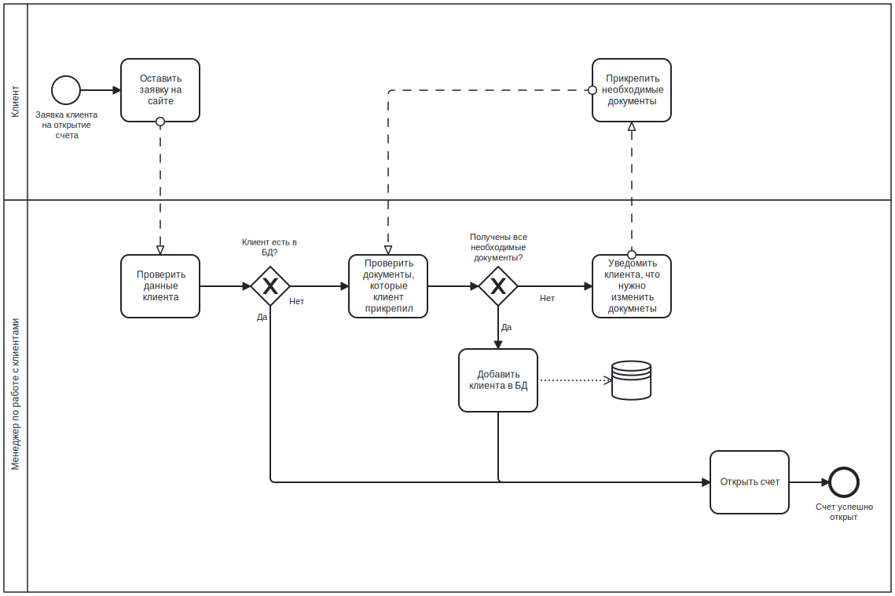

# Задание 1

Роли:

| Роль                           | Задачи ИС                                                                                                                |
|--------------------------------|--------------------------------------------------------------------------------------------------------------------------|
| Клиент                         | Создание заявок на открытие или закрытие счетов, просмотр информации по счетам, проверка статуса заявок.                 |
| Менеджер по работе с клиентами | Регистрация клиентов, открытие счетов.                                                                                   |
| Специалист по финансам         | Проведение транзакций и платежей, подтверждение и закрытие счетов, предоставление выписок и отчетов.                     |
| Финансовый аналитик            | Доступ к финансовым отчетам, анализ транзакций, прогнозирование доходов, генерация аналитических отчетов.                |
| Специалист по безопасности     | Проверка информации о клиентах, управление правилами безопасности, контроль подозрительных операций, доступ к аналитике. |
| Системный администратор        | Управление учетными записями сотрудников, контроль доступа к системе, мониторинг и поддержка инфраструктуры ИС.          |
| Оператор колл-центра           | Прием и обработка запросов клиентов, предоставление информации по продуктам банка, создание заявок в CRM-системе.        |

Процесс "открытие счета клиентом":



# Задание 2. Испорт/экспорт

Раньше справочники создавались через sql команды.

```postgresql
INSERT INTO public.currencies (name, in_rub)
VALUES ('Рубли', 1.00),
       ('Доллары США', 89.35),
       ('Юани', 12.60);

INSERT INTO public.departments (name)
VALUES ('Отдел вкладов'),
       ('Отдел обслуживания клиентов'),
       ('Отдел маркетинга');

INSERT INTO public.positions (name)
VALUES ('Менеджер'),
       ('Младший консультант'),
       ('Старший консультант'),
       ('Директор');

INSERT INTO public.deposits (name, duration, rate, currency_id)
VALUES ('Накопительный', 13, 10.00, 1),
       ('Капитал', 18, 7.00, 2),
       ('Друзья', 13, 2.00, 3),
       ('Пенсионный', 12, 12.00, 1),
       ('Молодежный', 36, 18.00, 1);
```

Теперь они импортируются из csv

Файлы для импорта: [for_import](for_import)

Команда для импорта:

```bash
psql -h localhost -p 5432 -d deposit -U postgres
```

```psql
\copy currencies (name, in_rub) FROM 'currencies.csv' DELIMITER ',' CSV HEADER;
\copy departments (name) FROM 'departments.csv' DELIMITER ',' CSV HEADER;
\copy positions (name) FROM 'positions.csv' DELIMITER ',' CSV HEADER;
\copy deposits (name, duration, rate, currency_id) FROM 'deposits.csv' DELIMITER ',' CSV HEADER;
```

Экспорт в svg справочников

```
\copy (SELECT * FROM currencies) TO 'currencies.csv' DELIMITER ',' CSV HEADER;
\copy (SELECT * FROM departments) TO 'departments.csv' DELIMITER ',' CSV HEADER;
\copy (SELECT * FROM positions) TO 'positions.csv' DELIMITER ',' CSV HEADER;
\copy (SELECT * FROM deposits) TO 'deposits.csv' DELIMITER ',' CSV HEADER;
```

# Задание 3. Триггер

- Триггер: удаление записи в справочнике departments
- Действие: сохранение старой записи в отдельной таблице с указанием данных инициатора изменений

Создание таблицы для хранения удаленных записей в справочнике departments

```postgresql
CREATE TABLE deleted_departments
(
    id              SERIAL PRIMARY KEY,
    department_id   INT         NOT NULL,
    department_name VARCHAR(50) NOT NULL,
    deleted_by      VARCHAR(50) NOT NULL,
    deleted_at      TIMESTAMP DEFAULT CURRENT_TIMESTAMP
);
```

Функция для триггера:

```postgresql
CREATE FUNCTION log_department_deletion()
    RETURNS TRIGGER AS
$$
BEGIN
    INSERT INTO deleted_departments(department_id, department_name, deleted_by)
    VALUES (OLD.id, OLD.name, session_user);
    RETURN OLD;
END;
$$
    LANGUAGE plpgsql;
```

Триггер:

```postgresql
CREATE TRIGGER trigger_department_deletion
    BEFORE DELETE
    ON departments
    FOR EACH ROW
EXECUTE FUNCTION log_department_deletion();
```

Проверка:

```postgresql
SELECT *
FROM departments;
DELETE
FROM departments
WHERE id = 1;
SELECT *
FROM departments;
```

До:

| id | name                        |
|:---|:----------------------------|
| 1  | Отдел вкладов               |
| 2  | Отдел обслуживания клиентов |
| 3  | Отдел маркетинга            |

После:

| id | name                        |
|:---|:----------------------------|
| 2  | Отдел обслуживания клиентов |
| 3  | Отдел маркетинга            |

| id | department\_id | department\_name | deleted\_by | deleted\_at                |
|:---|:---------------|:-----------------|:------------|:---------------------------|
| 1  | 1              | Отдел вкладов    | postgres    | 2024-10-21 12:18:40.620103 |

# Задание 4. Бекап

Создать резервную копию БД

```bash
pg_dump -h localhost -p 5432 -U postgres -d deposit > backup.sql
```

[Посмотреть SQL код бекапа](backup.sql)

Удалить БД


```postgresql
DROP TABLE deposits, accounts, clients, currencies, deleted_departments, departments, employees, positions CASCADE;
```


Восстановить БД

```bash
psql -h localhost -p 5432 -d deposit -U postgres -f backup.sql
```


